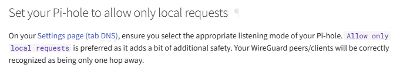

# Useful commands

## Inital server install

### Packages
```bash
sudo add-apt-repository ppa:wireguard/wireguard
sudo apt update
sudo apt install wireguard wireguard-tools
```
### Setup
```bash
sudo -i
cd /etc/wireguard
umask 077 # Security
wg genkey | tee server.key | wg pubkey > server.pub # Keygen
```
```bash
sudo nano /etc/wireguard/wg0.conf
#place
[Interface]
Address = 10.100.0.1/24, fd08:4711::1/64
ListenPort = 47111
```
```bash
echo "PrivateKey = $(cat server.key)" >> /etc/wireguard/wg0.conf
exit # Exit the sudo session
```
### Start
```bash
sudo systemctl enable wg-quick@wg0.service
sudo systemctl daemon-reload
sudo systemctl start wg-quick@wg0
```

### test
```bash
sudo wg
```
### Example
```
interface: wg0
  public key: XYZ123456ABC=   ⬅ Your public key will be different
  private key: (hidden)
  listening port: 47111
```



## Client

### Quick and easy
```bash
chmod +x [script_path](../wireguard/client_create.sh)
sudo -i
cd /etc/wireguard

[script_path](../wireguard/client_create.sh) "10.100.0." "fd08:4711::" "my_server_domain:47111" 2 "annas-android"
[script_path](../wireguard/client_create.sh) "10.100.0." "fd08:4711::" "my_server_domain:47111" 3 "peters-laptop"

exit
```
to generate two clients:

- annas-android with addresses 10.100.0.2 and fd08:4711::2
- peters-laptop with addresses 10.100.0.3 and fd08:4711::3

connecting to the server running at my_server_domain:47111


### Step by step
 Make keys
```bash
sudo -i
cd /etc/wireguard
umask 077
name="client_name"
wg genkey | tee "${name}.key" | wg pubkey > "${name}.pub"
```
#### Generate PSK (pre-shared-key)

**We furthermore recommend generating a pre-shared key (PSK) in addition to the keys above. This adds an additional layer of symmetric-key cryptography to be mixed into the already existing public-key cryptography and is mainly for post-quantum resistance. A pre-shared key should be generated for each peer pair and should not be reused.**

```bash
wg genpsk > "${name}.psk"
```

#### Add client to server config
```bash
echo "[Peer]" >> /etc/wireguard/wg0.conf
echo "PublicKey = $(cat "${name}.pub")" >> /etc/wireguard/wg0.conf
echo "PresharedKey = $(cat "${name}.psk")" >> /etc/wireguard/wg0.conf
echo "AllowedIPs = 10.100.0.2/32, fd08:4711::2/128" >> /etc/wireguard/wg0.conf
```
#### Reload the conf
```bash
wg syncconf wg0 <(wg-quick strip wg0)
```

Check the configuration
```sudo wg```

Example
```
interface: wg0
  public key: XYZ123456ABC=          ⬅ Your server's public key will be different
  private key: (hidden)
  listening port: 47111

peer: F+80gbmHVlOrU+es13S18oMEX2g=   ⬅ Your peer's public key will be different
  preshared key: (hidden)
  allowed ips: 10.100.0.2/32, fd08:4711::2/128
```

#### Create client config
create name.conf
```bash
echo "[Interface]" > "${name}.conf"
echo "Address = 10.100.0.2/32, fd08:4711::2/128" >> "${name}.conf" # May need editing
echo "DNS = 10.100.0.1" >> "${name}.conf"                          # Your Pi-hole's IP
```

Add the private key
```bash
echo "PrivateKey = $(cat "${name}.key")" >> "${name}.conf"
```

add your server as a peer
```
[Peer]
AllowedIPs = 10.100.0.1/32, fd08:4711::1/128
Endpoint = [your public IP or domain]:47111
PersistentKeepalive = 25
```

Qr code 
```bash
sudo qrencode -t ansiutf8 < "/etc/wireguard/${name}.conf"
```

Test for DNS leaks¶
You should run a DNS leak test on [www.dnsleaktest.com](https://www.dnsleaktest.com/) to ensure your WireGuard tunnel does not leak DNS requests (so all are processed by your Pi-hole). The expected outcome is that you should only see DNS servers belonging to the upstream DNS destination you selected in Pi-hole. If you configured [Pi-hole as All-Around DNS Solution](https://docs.pi-hole.net/guides/dns/unbound/), you should only see the public IP address of your WireGuard server and no other DNS server.

See also [What is a DNS leak and why should I care?](https://www.dnsleaktest.com/what-is-a-dns-leak.html).

## QR Code for Client Connect
- sudo apt install qrencode
- for png : ```qrencode -t png -o client.png -r client.conf```
- for in terminal : ```qrencode -t ansiutf8 < "client.conf"```